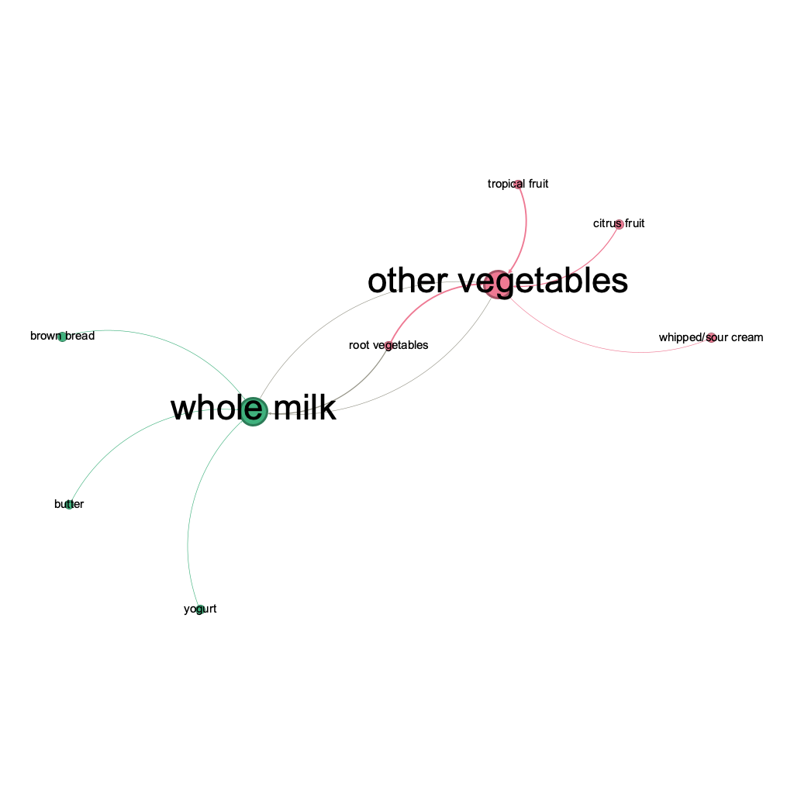

```{r}
library(arules)
library(arulesViz)
library(ggplot2)
library(tidyverse)
library(igraph)
```

# 8. Association rule mining

Revisit the notes on association rule mining and the R example on music playlists: playlists.R and playlists.csv. Then use the data on grocery purchases in groceries.txt and find some interesting association rules for these shopping baskets. The data file is a list of shopping baskets: one person's basket for each row, with multiple items per row separated by commas. Pick your own thresholds for lift and confidence; just be clear what these thresholds are and say why you picked them. Do your discovered item sets make sense? Present your discoveries in an interesting and visually appealing way.

Notes:

-   This is an exercise in visual and numerical story-telling. Do be clear in your description of what you've done, but keep the focus on the data, the figures, and the insights your analysis has drawn from the data, rather than technical details.
-   The data file is a list of baskets: one row per basket, with multiple items per row separated by commas. You'll have to cobble together your own code for processing this into the format expected by the "arules" package. This is not intrinsically all that hard, but it is the kind of data-wrangling wrinkle you'll encounter frequently on real problems, where your software package expects data in one format and the data comes in a different format. Figuring out how to bridge that gap is part of the assignment, and so we won't be giving tips on this front.

```{r}
groceries <- read.transactions(file="groceries.txt",
                               sep = ',',format="basket",rm.duplicates=TRUE)
head(groceries)
summary(groceries)
```

```{r}
# Plot the item frequency
itemFrequencyPlot(groceries, topN = 20, type = "absolute",
                  main = "Top 20 Items Frequency in Groceries Dataset")
```
We can expect rules with the above items to have higher supports. Confidence and lift will need to be investigated.

## Support

**Definition:** Support is the proportion of transactions in the dataset that contain a particular itemset (both the antecedent and consequent of a rule).

**Mathematical Expression:** For a rule $A \rightarrow B$, the support is calculated as:

$$
\text{Support}(A \rightarrow B) = \frac{\text{Number of transactions containing both } A \text{ and } B}{\text{Total number of transactions}}
$$

**Interpretation:** Support measures how frequently the itemset (both items in the rule) occurs in the dataset. A higher support indicates that the itemset is common in the transactions, while a lower support indicates that the itemset is rare.

## Confidence

**Definition:** Confidence is the proportion of transactions that contain the antecedent (e.g., itemset $A$) that also contain the consequent (e.g., itemset $B$).

**Mathematical Expression:** For a rule $A \rightarrow B$, confidence is calculated as:

$$
\text{Confidence}(A \rightarrow B) = \frac{\text{Number of transactions containing both } A \text{ and } B}{\text{Number of transactions containing } A}
$$

**Interpretation:** Confidence measures the likelihood that the consequent of the rule (itemset $B$) is also purchased when the antecedent (itemset $A$) is purchased. Higher confidence indicates that the rule $A \rightarrow B$ is more reliable, meaning that whenever $A$ is bought, $B$ is also likely to be bought.

## Example in the Grocery Dataset

Suppose you have a rule $\text{Milk} \rightarrow \text{Bread}$.

-   **Support:** If the support for this rule is 0.2, it means that 20% of all transactions in the dataset contain both milk and bread.
-   **Confidence:** If the confidence for this rule is 0.8, it means that 80% of the transactions that include milk also include bread.

```{r}
print(paste('Size of the dataset: ', dim(groceries)[1]))
```

Since the data set has around 10,000 rows, the support should be around 0.1% (containing at least 10 instances) to be worth investigation. The following thresholds were chosen for the interpretability of a graph later in this file.

```{r}
# Create association rules
support_threshold <- .001 #item set appears in at least 10 transactions
confidence_threshold <- 0.7 #more reliable rules
maxlength <- 5 #to filter for interpretable, actionable rules

groceries_rules = apriori(groceries,
                          parameter=list(support=support_threshold,
                                         confidence=confidence_threshold,
                                         maxlen=maxlength))

# inspect(groceries_rules)
length(groceries_rules)
```

## Definition of Lift

**Lift** is the ratio of the observed support for the rule to the expected support if the items were independent.\
It tells you how many times more likely the consequent is to be found in transactions that contain the antecedent compared to transactions that do not contain the antecedent.

## Mathematical Expression

For a rule $A \rightarrow B$, lift is calculated as:

$$
\text{Lift}(A \rightarrow B) = \frac{\text{Support}(A \rightarrow B)}{\text{Support}(A) \times \text{Support}(B)}
$$

Where: - **Support(A → B):** The proportion of transactions containing both $A$ and $B$. - **Support(A):** The proportion of transactions containing $A$. - **Support(B):** The proportion of transactions containing $B$.

## Interpretation

-   **Lift = 1:** The antecedent and consequent are independent of each other, meaning the presence of $A$ does not influence the presence of $B$.
-   **Lift \> 1:** There is a positive association between the antecedent and consequent, meaning that the presence of $A$ increases the likelihood of $B$ occurring. The higher the lift, the stronger the association.
-   **Lift \< 1:** There is a negative association between the antecedent and consequent, meaning that the presence of $A$ actually decreases the likelihood of $B$ occurring.

## Example in the Grocery Dataset

Suppose you have a rule $\text{Milk} \rightarrow \text{Bread}$ with a lift of 3.\
This means that customers who buy milk are three times more likely to also buy bread compared to a random customer buying bread.\
A lift greater than 1 indicates that the rule is meaningful and the items in the rule are associated in a way that is more than just by chance.

```{r}
plot(groceries_rules)
```
**Takeaways:** The above graph shows the relationship between confidence and support as colored by lift. As you can see from the graph, support and confidence are negatively correlated. This is because as the support of a rule increases, the rule becomes less specific, reducing its confidence. Higher confidence often occurs with rules that have lower support, as they apply to fewer, more targeted transactions where the antecedent strongly predicts the consequent. 
In this set, this is also such case with lift and support. The more that an item set appears, the more expected that item set is to appear randomly, and there is not much additional predictive power.

# Comparing Different Rule Subsets
We create different groups of association rules by adjusting the thresholds. 

## 1: Test a the Same Support Threshold and Higher Lift Threshold:

```{r, results= "hide"}
support_threshold1 <- 0.001 #item set appears in at least 10 people
lift_threshold1 <- 3 #antecedent leads to 2 times likelihood of consequent
inspect(subset(groceries_rules, lift > lift_threshold1 & support > support_threshold1))
length(subset(groceries_rules, lift > lift_threshold1 & support > support_threshold1))
```

```{r}
plot(subset(groceries_rules, lift > lift_threshold1 & support > support_threshold1))
```
**Insights:** This is similar to the previous plot but with much less noise (only lift > 3). These are all rules which are powerful enough to be worth investment; however, many rules only appear in 10 to 20 people.

```{r}
groceries_rules2 = subset(groceries_rules, lift > support_threshold1 & support > support_threshold1)
plot(head(sort(groceries_rules2, by="lift"), 10),
  method="graph", control=list(cex=.9), main = "Top 10 Groceries Rules (High Support, Low Lift)")
```
**Takeaways:** The above graph represents with higher lifts. There seems to be two core clusters, with one as liquor and another as produce and dairy. This is a great graph showing the grocery items that are important as well as their corresponding rules, but let's see if we can extract rules that apply to more people.

## 2: Test a Higher Support Threshold and Higher Lift Threshold:

```{r}
support_threshold2 <- 0.003 #item set appears in at least 30 people
lift_threshold2 <- 3 #antecedent leads to 3 times likelihood of consequent
inspect(subset(groceries_rules, lift > lift_threshold2 & support > support_threshold2))
length(subset(groceries_rules, lift > lift_threshold2 & support > support_threshold2))
```
The two consequents are whole milk and other vegetables. This is not surprising since these are core to the american diet. The antecedents, however, are rather interesting, with the inclusion of whipped/sour cream together with vegetables. Yogurt with butter and root vegetables leading to whole milk is also rather interesting in this specific combination. These rules reveal great opportunities for cross-merchandising.

```{r}
plot(subset(groceries_rules, lift > lift_threshold2 & support > support_threshold2))
```
**Insights:** We can see that increasing the support threshold has removed many rules with low lifts, but also removed the rules with higher lifts than 4.5. This means that although these removed rules are very strong (lift > 4.5), these rules only appear in less than 30 transactions (support < 0.003). From a business perspective, these are especially relevant to target when breaking into niche markets. However, for the sake of this analysis, we will focus on higher support rules to understand general trends that are also strong.

```{r}
groceries_rules2 = subset(groceries_rules, lift > lift_threshold2 & support > support_threshold2)
plot(groceries_rules2,
  method="graph", control=list(cex=.9), main = "Top 5 Groceries Rules (High Support, High Lift)")
```
**Description:** The above graph represents the top 5 rules when filtered for a support of 0.3% (30 instances) and a lift of 3 (rule is 3 times more likely than a random buyer). As expected, the grocery items included are core to the american diet (bread, fruit, milk, etc.), although yogurt is an interesting inclusion.

**Insights:** As compared to the previous graph with a lower support threshold, the liquor relationship has disappeared. This rule is important for wine and liquor companies; however, the grocery stores themselves can focus on the other rules that have survived these higher thresholds. Ideally, after considering profit margins, these will be the rules that lead to the highest ROI. Of course, these patterns will change seasonally and geographically, as we can expect that strong rules with turkey will emerge around November each year in the United States.

```{r}
groceries_graph = associations2igraph(groceries_rules2, associationsAsNodes = FALSE)
igraph::write_graph(groceries_graph, file='groceriesrules.graphml', format = "graphml")
```

```{r}
#extract the max lift
max_lift_rule <- groceries_rules[which.max(groceries_rules@quality$lift)]
inspect(max_lift_rule)

#extract the max support
max_support_rule <- groceries_rules[which.max(groceries_rules@quality$support)]
inspect(max_support_rule)

#extract the max confidence
max_confidence_rule <- groceries_rules[which.max(groceries_rules@quality$confidence)]
inspect(max_confidence_rule)
```

## Notable Examples:
**Best Balance of High Lift and High Support**
($\text{citrus fruit, root vegetables, tropical fruit} \rightarrow \text{other vegetables}$)

* Support = 0.0045. This item set appears in 0.45% of the transactions. (45 instances).
* Confidence = 0.79. If a customer purchases the antecedent, they also purchase other vegetables 79% of the time.
* Lift = 4.06. Buying citrus fruit, root vegetables, tropical fruit, makes the buying other vegetables 4 times more likely compared to the overall baseline probability. 
* Interpretation: This insight makes sense because of the need for fresh produce in cooking.

**Highest Lift: 11**
($\text{liquor, red/blush wine} \rightarrow \text{bottled beer}$)

* Support = 0.0019 This item set appears in 0.19% of the transactions. (19 instances).
* Confidence = 0.91. If a customer purchases liquor or red/blush wine, they also purchase bottled beer 91% of the time.
* Lift = 11.24. Buying liquor and red/blush wine makes the buying bottled beer 11 times more likely compared to the overall baseline probability. 
* Interpretation: This is not surprising when considering drinking culture in the United States.

**Highest Support: 0.57%**
($\text{root vegetables, tropical fruit, yogurt} \rightarrow \text{whole milk}$)

* Support = 0.0057 This item set appears in 0.45% of the transactions. (45 instances).
* Confidence = 0.7. If a customer purchases the antecedent, they also purchase whole milk 70% of the time.
* Lift = 2.74. Buying root vegetables, tropical fruit, yogurt makes the buying whole milk 2.74 times more likely compared to the overall baseline probability.
* Interpretation: This rule is valuable because it has a relatively high support and lift, indicating that these items are commonly bought together in a significant number of transactions.

**Highest Confidence: 1**
($\text{rice, sugar} \rightarrow \text{whole milk}$)

* Support = 0.0012. This item set appears in 0.12% of the transactions (12 instances).
* Confidence = 1. If a customer purchases rice and sugar, they also purchase whole milk 100% of the time.
* Lift = 3.91. Buying rice and sugar makes the buying whole milk 3.91 times more likely compared to the overall baseline probability.
* Interpretation: This is an unexpected rule to have perfect confidence, and it is interesting for further investigation.

## Takeaways:
* The above rules are all important to consider depending on the business goal. Whether it is to capture the greatest number of customers (highest support), be the most certain about their investment (highest confidence), or have targeted marketing and upselling (highest lift). Most of these above rules, however, have a strikingly good balance of all three.
